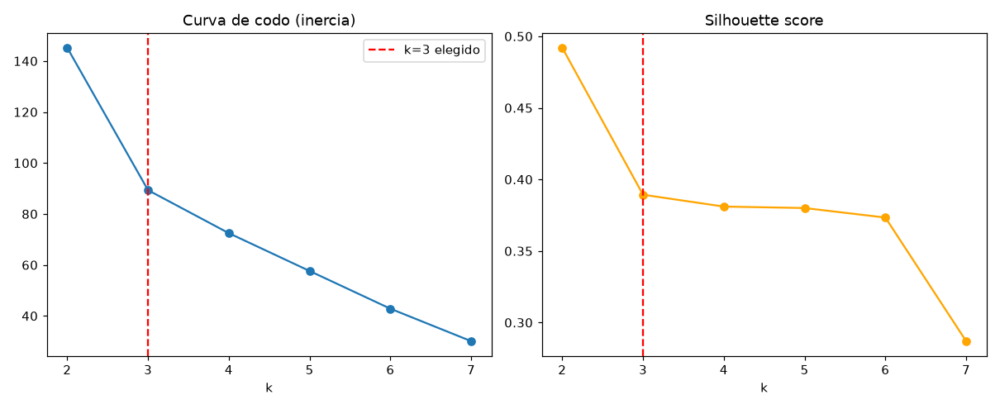

# Tipología de perfiles de zona — K-Means (Issue #27)

**Responsable:** Integrante 3 (Clustering) · **Estado:** entrenado, insumo directo
de la API (`GET /zonas-riesgo`) y el dashboard · **Fecha:** 2026-07-09

Este documento justifica el `k` elegido para el K-Means de perfiles de zona y
documenta la tipología resultante. Generado por
`python models/clustering/train.py` a partir de
`models/clustering/features_zona.parquet` (#26). Los artefactos serializados
(`clusters.joblib`, `zona_cluster.parquet`) no se versionan en git (regla
global `*.parquet`/`*.joblib` de `.gitignore`) — se regeneran corriendo el
script. La figura de codo + silhouette sí se versiona en
`reports/figures/clustering_elbow_silhouette.png`.

---

## 1. Curva de codo + silhouette

| k | inercia | silhouette | tamaños de cluster |
|---|---|---|---|
| 2 | 145.23 | **0.492** | 17, 3 |
| 3 | 89.34  | 0.389 | 12, 6, 2 |
| 4 | 72.47  | 0.381 | 12, 4, 2, 2 |
| 5 | 57.63  | 0.380 | 12, 3, 2, 2, 1 |
| 6 | 42.83  | 0.373 | 12, 3, 2, 1, 1, 1 |
| 7 | 30.09  | 0.287 | 7, 5, 3, 2, 1, 1, 1 |

## 2. Por qué k=3 (y no el silhouette máximo, k=2)

El silhouette más alto es k=2 (0.492), pero produce un corte binario (17 vs 3
localidades) que no distingue más que "alto impacto vs. resto" — poco útil
como *tipología* con varios perfiles nombrables.

El **codo real de la curva de inercia está en k=3**: la caída entre k=2→3 es
de 55.9 puntos, y a partir de ahí la curva se aplana (16.9, 14.8, 14.8, 12.7
puntos por paso siguiente) — la segunda derivada cae de forma abrupta
(−39.0) justo en k=3 y se mantiene casi plana después (−2.0, −0.04, −2.1).

Además, **k=3 produce 3 perfiles genuinamente distintos e interpretables**
al mirar los centroides (Sección 3) — a diferencia de k=4/5/6, donde los
clusters adicionales son fragmentos de 1-2 localidades sin una lectura clara
propia. Se justifica **k=3 por codo + interpretabilidad**, documentando
honestamente que el silhouette de k=2 es mayor.

**Parámetros reproducibles:** `k=3, n_init=10, random_state=42`, rango
explorado `k=2..7`. Guardados dentro de `clusters.joblib`.

## 3. Tabla de perfiles

| Cluster | n zonas | Nombre | Localidades |
|---|---|---|---|
| Alto impacto | 2 | **Perfil de alto impacto generalizado** | Candelaria, Los Mártires |
| Hurto de bienes | 6 | **Perfil hurto de bienes / ingreso alto** | Antonio Nariño, Barrios Unidos, Chapinero, Puente Aranda, Santa Fe, Teusaquillo |
| Bajo incidente | 12 | **Perfil de bajo incidente relativo** | Bosa, Ciudad Bolívar, Engativá, Fontibón, Kennedy, Rafael Uribe Uribe, San Cristóbal, Suba, **Sumapaz**, Tunjuelito, Usaquén, Usme |

### Regla de nombrado (por centroides, no por índice)

1. El cluster con mayor intensidad promedio en las 11 tasas de tipo de delito
   (y > 1.0, claramente sobre el promedio) → "Perfil de alto impacto
   generalizado".
2. Si no aplica lo anterior y (promedio patrimonial − promedio violento) >
   0.3 → "Perfil hurto de bienes / ingreso alto".
3. En cualquier otro caso → "Perfil de bajo incidente relativo".

Implementación en `models/clustering/clustering.py::nombrar_clusters`.

## 4. Lectura accionable por perfil

**Perfil de alto impacto generalizado (Candelaria, Los Mártires).** Estas dos
localidades del centro histórico y comercial de Bogotá concentran tasas por
100k habitantes muy por encima del resto en **todos** los tipos de delito
medidos, sin excepción, además de un volumen de llamadas al 123 igualmente
alto. No es un perfil de un solo tipo de delito: es alta incidencia
generalizada, consistente con ser zonas de altísima afluencia diurna/nocturna
y baja población residente (denominador pequeño inflando las tasas por 100k).
Lectura para planeación: son las dos únicas zonas que requieren atención
transversal a casi todos los tipos de delito a la vez, no una intervención
focalizada en un solo tipo.

**Perfil hurto de bienes / ingreso alto (Antonio Nariño, Barrios Unidos,
Chapinero, Puente Aranda, Santa Fe, Teusaquillo).** Estas seis localidades
tienen tasas elevadas específicamente en delitos patrimoniales (hurto de
autos, bicicletas, comercio, celulares, residencias) pero **no** en violencia
interpersonal (homicidios, violencia intrafamiliar, lesiones), y un `ipm_nbi`
consistentemente bajo (zonas de mayor ingreso relativo). Lectura para
planeación: el foco aquí es prevención situacional del hurto de bienes
(vigilancia comercial, seguridad vehicular/residencial), no un problema de
violencia social — mezclar ambos en una sola estrategia sería impreciso.

**Perfil de bajo incidente relativo (Bosa, Ciudad Bolívar, Engativá,
Fontibón, Kennedy, Rafael Uribe Uribe, San Cristóbal, Suba, Sumapaz,
Tunjuelito, Usaquén, Usme).** El grupo más numeroso (12 de 20 localidades):
tasas por debajo del promedio en casi todos los tipos de delito. Incluye
localidades de perfil socioeconómico muy distinto entre sí (desde Usaquén
hasta Ciudad Bolívar y la rural Sumapaz) — el clustering las agrupa por tener
tasas *relativamente* bajas frente al resto de la ciudad, no porque sean
homogéneas en otros aspectos. **Nota sobre Sumapaz:** a diferencia del
clustering jerárquico exploratorio de #25 (donde Sumapaz quedaba aislada en
su propio grupo en todos los k probados), en este K-Means real cae dentro de
este cluster grande — es un resultado distinto pero legítimo (algoritmo y
espacio de features distintos); no se fuerza a un resultado distinto.

## 5. Reproducibilidad

`clusters.joblib` guarda un diccionario con `modelo` (el `KMeans` entrenado),
`k`, `n_init`, `random_state`, `columnas_features` (orden exacto de columnas
de `features_zona.parquet` usado para entrenar) y `nombre_perfil` (mapeo
`cluster -> nombre`). Cualquier nuevo cálculo de cluster para una zona debe
usar exactamente esas mismas columnas en el mismo orden.
